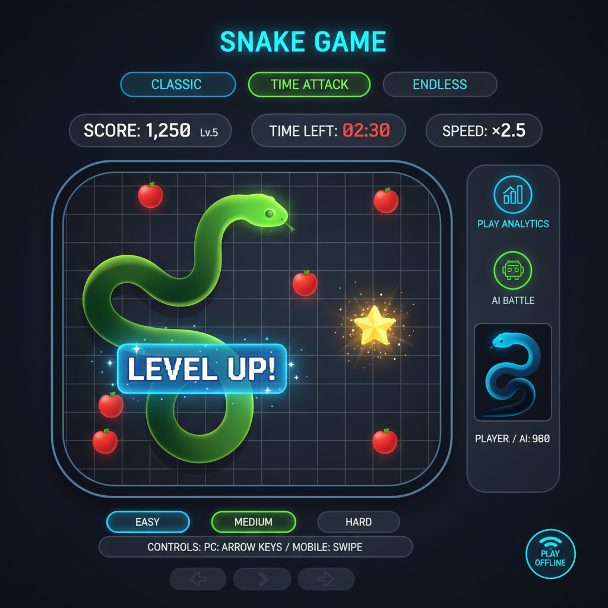

# ネオンスネークアリーナ

古い携帯電話の片隅で生まれた蛇は、ここでネオンに照らされながら新しい進化を遂げます。AI がライバルとなり、もう一人のコーチにもなってくれるスネークゲームです。短い手持ち時間でも、集中して腕を磨きたい夜でも、ここで過ごす数分は確かな余韻を残します。



## 目次
1. [コンセプト](#コンセプト)
2. [主な特徴](#主な特徴)
3. [ゲームモードと難易度](#ゲームモードと難易度)
4. [AIとプレイ分析](#aiとプレイ分析)
5. [技術スタック](#技術スタック)
6. [ディレクトリ構成](#ディレクトリ構成)
7. [セットアップ](#セットアップ)
8. [環境変数](#環境変数)
9. [利用可能なスクリプト](#利用可能なスクリプト)
10. [PWA / オフライン対応](#pwa--オフライン対応)
11. [テスト戦略](#テスト戦略)
12. [ドキュメント](#ドキュメント)
13. [ロードマップ](#ロードマップ)

## コンセプト

- **目的**: 反射神経と戦略を同時に刺激しながら、毎回違う学びをもたらすスネーク体験を作る。
- **解決したい課題**: 単調で飽きやすいゲームサイクル、成長を実感しづらい体験。
- **アプローチ**: AI スネークとの攻防とプレイスタイル分析を組み合わせ、練習とフィードバックを 1 つの画面で完結させる。

## 主な特徴

- **マルチデバイス操作**: デスクトップでは矢印キー（または WASD）、モバイルではスワイプ操作を検知して即座に反映。
- **多彩な餌システム**: 通常餌に加えてスピードブースト、スコア 2 倍、体縮小など戦況を変える特殊餌を実装。
- **ネオンレトロ UI**: グラデーション背景とグローエフェクトで、懐かしさと未来感が同居するデザイン。
- **統計 HUD**: スコア・レベル・速度・残り時間・AI とのスコア差をリアルタイム表示し、状況判断を助ける。
- **IndexedDB ベースの履歴**: Dexie.js でモード別ハイスコアや生存時間を永続化し、PWA でも欠かさず同期。
- **オフラインで完結**: Service Worker によりゲーム、対戦 AI、簡易アドバイスまですべてオフライン可。

## ゲームモードと難易度

| モード | 内容 | 終了条件 | 特記事項 |
| --- | --- | --- | --- |
| クラシック | 伝統的なサバイバル | 自己 or 壁衝突 | ハイスコア狙い |
| タイムアタック | 3/5/10 分の制限時間戦 | タイムアップ or 衝突 | 残り時間を HUD に表示 |
| エンドレス | 反対側にワープ | なし（自己衝突で縮小） | 長時間プレイと瞑想的体験 |

難易度は **Easy / Medium / Hard** の 3 段階。速度倍率とレベルアップカーブが変化し、AI スネークの賢さ・攻撃性も連動して上がります。

## AIとプレイ分析

- **AI スネーク対戦**: A* アルゴリズムで餌へ最短接近しつつプレイヤーとの衝突を回避。速度と思考幅が難易度で変化。
- **プレイスタイル分析**:
  - `app/actions/ai.ts` から Server Actions を呼び出し、Google Gemini API（`gemini-2.5-flash`）でサマリ・強み・改善点・具体的アドバイスを生成。
  - API キー未設定時はフォールバックロジックが生存時間やスコア効率から評価を組み立て、体験を途切れさせません。
- **記録項目**: スコア効率、餌ごとの平均スコア、リスクテイク傾向、特殊餌取得率、AI 対戦勝率などをローカルで保存。

## 技術スタック

- **Framework**: Next.js 14.2 (App Router) + React 18
- **Language**: TypeScript / JSX
- **State**: Zustand でゲーム設定と HUD を一元管理
- **Storage**: Dexie.js 経由の IndexedDB
- **Styling**: Tailwind CSS 3 + カスタム CSS アニメーション
- **AI**: Google Gemini API（Primary）、ローカルヒューリスティック（Fallback）
- **PWA**: `next-pwa` + Workbox、`requestAnimationFrame` で 60fps ループ
- **Testing**: Jest + Testing Library（ユニット / コンポーネント）、Playwright（E2E）

## ディレクトリ構成

```
app/
├─ page.tsx              # ランディング兼モード選択
├─ play/page.tsx         # ゲーム画面、HUD、タッチ入力
├─ results/page.tsx      # AI アドバイス表示
├─ history/page.tsx      # 履歴とグラフ
└─ actions/ai.ts         # Gemini を呼ぶ Server Action
components/
├─ GameField.tsx         # 20x20 グリッド描画
├─ ModeSelector.tsx      # モード / 難易度 UI
├─ AIControls.tsx        # AI 対戦・分析トリガ
└─ GameStats.tsx         # スコア / レベル表示
lib/
├─ game/*                # ループ / 衝突 / スコア計算
├─ ai/*                  # パスファインディング / 分析
└─ db/*                  # Dexie スキーマ
doc/                     # 要件・設計・実装計画
```

## セットアップ

1. **依存関係のインストール**
   ```bash
   npm install
   ```
2. **開発サーバ起動**
   ```bash
   npm run dev
   ```
   - 既定ポート: `http://localhost:3000`
   - 起動後はブラウザでアクセスし、キーボードまたはスワイプで操作できます。
3. **本番ビルド & プレビュー**
   ```bash
   npm run build
   npm start
   ```

> Node.js 18.18+ もしくは 20.x LTS を推奨しています。Playwright を利用する場合はブラウザバイナリのインストール（`npx playwright install`）も忘れずに。

## 環境変数

| 変数名 | 役割 | 必須 |
| --- | --- | --- |
| `GEMINI_API_KEY` | Google Gemini API キー。Server Actions から `gemini-2.5-flash` を呼び出すために使用。 | 任意（未設定時はフォールバック分析） |

`.env.local` に記述してください。

```bash
GEMINI_API_KEY=your-api-key
```

## 利用可能なスクリプト

| コマンド | 用途 |
| --- | --- |
| `npm run dev` | Next.js 開発サーバ |
| `npm run build` | 本番ビルド |
| `npm start` | 本番モードサーバ |
| `npm run lint` | ESLint (Next.js 推奨設定) |
| `npm test` | Jest + Testing Library |
| `npm run test:watch` | Jest のウォッチモード |
| `npm run test:e2e` | Playwright E2E テスト |

## PWA / オフライン対応

- `next-pwa` と Workbox を利用し、ビルド時に Service Worker を生成。
- オフラインでも以下を提供:
  - ゲームプレイ / 体験全般
  - AI 対戦（ローカルアルゴリズム）
  - 簡易アドバイス（フォールバック）
- `manifest.json` と各種アイコンを `public/` に配置し、ホーム画面インストールをサポート。

## テスト戦略

- **ユニット / コンポーネント**: `__tests__` 配下でゲームループ、衝突判定、UI コンポーネントを検証。
- **E2E**: `playwright.config.ts` でモード選択からスコア記録までのフローを自動化。CI ではリトライ設定あり。
- **推奨フロー**: ロジック変更時は `npm test` → UI/操作を触ったら `npm run test:e2e`。

## ドキュメント

- [要件定義書](doc/requirements.md)
- [技術設計書](doc/technical-design.md)
- [実装計画書](doc/implementation-plan.md)

設計判断・データモデル・アニメーション仕様の詳細は上記ドキュメントにまとまっています。

## ロードマップ

- ランキング / 共有機能でのコミュニティ導線
- マルチスキンとカスタムフィールドエディタ
- クラウド同期によるクロスデバイス履歴
- 追加 AI プロバイダ（例: OpenAI Realtime API）への切り替えオプション

夜を明かしてでもスコアを伸ばしたい人も、ちょっとした息抜きを求める人も、この蛇と共に新しい風景を見つけてください。
